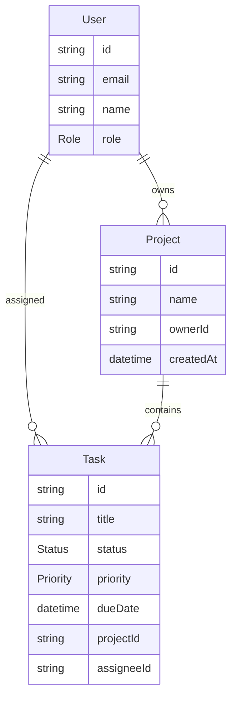

# Team Task Manager

A production-oriented monolith-first task manager built with Next.js App Router, Prisma, PostgreSQL, Clerk RBAC, Tailwind CSS, shadcn-style primitives, and Turborepo.

## Architecture

- `apps/web`: Next.js app, REST API routes, Clerk auth, dashboard UI.
- `packages/db`: Prisma schema, generated client wrapper, validation schemas.
- Runtime shape: one deployable Next.js service talking to Railway PostgreSQL.



## Local Setup

1. Copy `.env.example` to `.env` and fill in Railway PostgreSQL plus Clerk keys.
2. Install dependencies:

```bash
npm install
```

3. Generate Prisma and push the schema:

```bash
npm run db:generate
npm run db:push
```

4. Start development:

```bash
npm run dev
```

Open `http://localhost:3000`.

## Clerk RBAC

Set `publicMetadata.role` on a Clerk user to `ADMIN` for admin access. Missing or unknown roles default to `MEMBER`. The API also stores the resolved role in PostgreSQL for query filtering.

## REST API

Every route requires an authenticated Clerk session.

| Endpoint | Method | Role | Description |
| --- | --- | --- | --- |
| `/api/projects` | `GET` | Admin, Member | Admins see all projects; members see projects with assigned tasks or ownership. |
| `/api/projects` | `POST` | Admin | Create a project owned by the current admin. |
| `/api/tasks` | `POST` | Admin | Create a task in a project. |
| `/api/tasks/[id]` | `PATCH` | Admin, Member | Admins update all task fields; members can update only status on assigned tasks. |
| `/api/dashboard` | `GET` | Admin, Member | Returns task KPIs and upcoming tasks. |
| `/api/users` | `GET` | Admin | Returns users for assignment dropdowns. |

## Deployment On Railway

Provision PostgreSQL first, then set:

- `DATABASE_URL`
- `NEXT_PUBLIC_CLERK_PUBLISHABLE_KEY`
- `CLERK_SECRET_KEY`
- `NEXT_PUBLIC_APP_URL`

Railway build command:

```bash
npm run build
```

The web app build runs `prisma generate` before `next build`.
