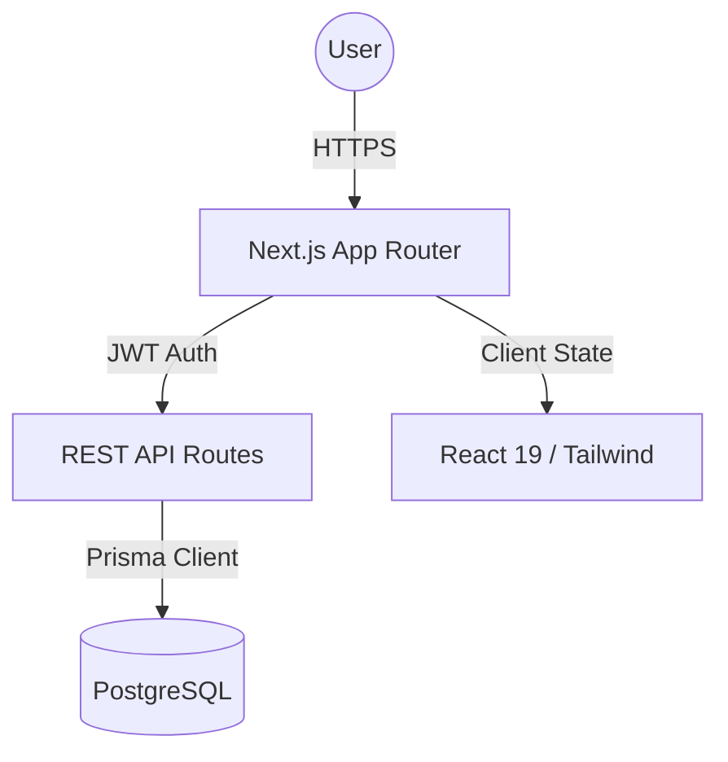

# 🚀 Team Task Manager: God-Level Edition

[](https://nextjs.org/)
[](https://www.typescriptlang.org/)
[](https://www.prisma.io/)
[](https://tailwindcss.com/)
[](https://opensource.org/licenses/MIT)

**Team Task Manager** is a high-performance, visually immersive project management platform. Engineered with a "monolith-first" philosophy, it combines a stunning glassmorphism aesthetic with defensive backend engineering and real-time synchronization patterns.

---

## ✨ Core Features

### 💎 God-Level UI/UX
- **Glassmorphism Design**: A premium aesthetic featuring backdrop blurs, subtle borders, and depth-oriented layouts.
- **Theme Orchestration**: Seamless switching between curated high-contrast Dark Mode and soft Light Mode.
- **Responsive Layout**: Fluidly adapts from desktop monitors to mobile devices.

### 📅 Dynamic Workspace
- **Kanban Task Board**: Visualize your workflow with optimistic state updates for zero-latency interactions.
- **Interactive Calendar**: Map team velocity and upcoming milestones on a sleek monthly grid.
- **Full CRUD Modal**: Edit every aspect of a task with an intelligent, role-aware modal interface.

### 🛡️ Defensive Engineering
- **RBAC (Role-Based Access Control)**: Strict permission hierarchies for Admins and Members.
- **Custom Auth Bedrock**: JWT-based session management with bcrypt-hashed credentials.
- **Atomic API Layer**: Zod-validated payloads and atomic database transactions ensure data integrity.

---

## 🏗️ Architecture



- **`apps/web`**: The heart of the platform. Handles SSR, client-side interactions, and API routes.
- **`packages/db`**: Centralized database layer containing the Prisma schema and Zod validation schemas.
- **`Turborepo`**: Optimized build pipelines and monorepo management.

---

## 🛠️ Quick Start

### 1. Environment Setup
Clone the repository and create your environment file:
```bash
cp .env.example .env
```
Ensure you have a **PostgreSQL** instance ready (e.g., via Railway or Docker).

### 2. Installation
Install dependencies using npm:
```bash
npm install
```

### 3. Database Initialization
Generate the Prisma client and sync your schema:
```bash
npm run db:generate
npm run db:push
```

### 4. Launch Development
Start the Turbo dev server:
```bash
npm run dev
```
Visit **`http://localhost:3000`** to experience the dashboard.

---

## 📖 Documentation

- **[API Documentation](file:///c:/Users/satwi/OneDrive/Desktop/task%20manager/api_documentation.md)**: Detailed technical specifications for all REST endpoints.
- **[Prisma Schema](file:///c:/Users/satwi/OneDrive/Desktop/task%20manager/packages/db/prisma/schema.prisma)**: The source of truth for the database architecture.

---

## 🚀 Deployment

Optimized for **Railway**.

1. Connect your GitHub repository to Railway.
2. Add your environment variables (`DATABASE_URL`, `JWT_SECRET`, etc.).
3. Railway will automatically detect the Turborepo setup and execute `npm run build`.

---

## ⚖️ License
Distributed under the MIT License. See `LICENSE` for more information.
